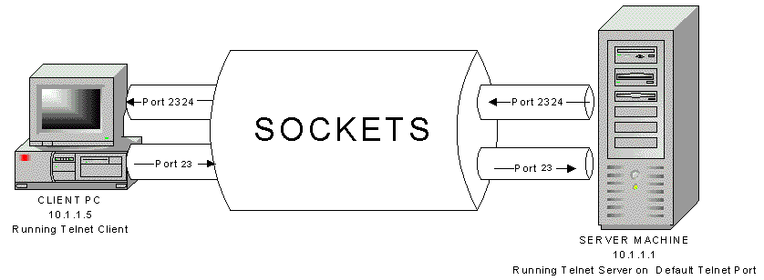

## 웹 서버 요청 송신 시 내부 동작

```dart
var data = FormData.fromMap({
  'files': [
    await MultipartFile.fromFile('.../carbon (14).png', filename: 'carbon (14).png')
  ],

});

var dio = Dio();
var response = await dio.request(
  'http://...:8080/image',
  options: Options(
    method: 'POST',
  ),
  data: data,
);

if (response.statusCode == 200) {
  print(json.encode(response.data));
}
else {
  print(response.statusMessage);
}
```

위와 같이 프론트, 앱 단에서 서버로 요청을 보내면 간단한 코드만으로도 요청을 보내고 받을 수 있다.

하지만 내부적으로는 간단하지 않다.  

1. Http request message 작성
2. 웹 서버의 IP 주소를 DNS 서버에서 조회
3. 프로토콜 스택에 메시지 송신 의뢰

위와 같은 과정을 거쳐 통신하게 된다. 

## 1. Http Request Message
HTTP: Hyper Text Transfer Protocol 
해석하면 Hyper Text를 옮기는 프로토콜인데,
>Hyper text: 하이퍼링크를 포함하는 텍스트를 말함.

예전에는 동적인 페이지를 보여주지 않았고 단순 html 페이지만 주고 받았으니 그때 Http 프로토콜이 만들어짐. 하지만 현재, REST API와 같이 json, xml을 주고 받을 때에도 Http 프로토콜을 사용한다. (역사적 맥락)

POST http://localhost:8080/image
200
1245 ms

```
POST /image HTTP/1.1
User-Agent: PostmanRuntime/7.43.0
Accept: */*
Cache-Control: no-cache
Postman-Token: c9052fbe-0055-498a-b17f-4dafafcaceb8
Host: localhost:8080
Accept-Encoding: gzip, deflate, br
Connection: keep-alive
Content-Type: multipart/form-data; boundary=--------------------------560522733579278160231126
Content-Length: 73159
 
----------------------------560522733579278160231126
Content-Disposition: form-data; name="image"; filename="carbon (14).png"
<carbon (14).png>
----------------------------560522733579278160231126--
 
HTTP/1.1 200 OK
Content-Length: 0
Date: Sun, 09 Mar 2025 09:50:43 GMT
Keep-Alive: timeout=60
Connection: keep-alive
 
```

## 2. IP 주소를 DNS 서버에서 조회


>DNS: Domain Name System으로 서버명과 IP주소를 대응시키기 위해 DNS를 많이 사용하지만, 메일 주소-메일 서버를 대응시키는 것 등 다양한 정보-이름을 대응해서 등록할 수 있다. 

위와 같이 **url에 기재된 서버의 이름과 대응된 실제 서버 ip**를 가져온다. 


Socket 라이브러리를 통해 DNS 서버에 조회 메시지를 보내는 **리졸버**를 호출하고 DNS 요청을 보내 정확한 ip를 가져온다. 


실제로 해당 ip로 접속하면 구글로 접속이 된다!  
*네이버는 되지 않음 (CDN 때문)


## 3. 프로토콜 스택에 메시지 송신 의뢰
  
프로토콜 스택이라는 것은 "OS 내부에서 네트워크 통신을 처리하는 소프트웨어"이다. 개발자는 소켓 API로 이에 대해 접근할 수 있다. 프로그래밍 코드가 아니면 접근할 수 없다. 

간단한 과정을 말하면
1. Request message를 만든다.
2. 송신하는 소켓 함수를 호출한다. 
3. TCP가 Request Message를 segment 단위로 쪼갠다
4. IP가 TCP 세그먼트를 패킷으로 감싸고 IP 헤더를 추가한다.
5. 이더넷이 IP 패킷을 frame으로 감싸고 이더넷 MAC 주소를 붙인다.
6. 물리적으로 변환되어서 전송된다. (최종)

이 6개의 과정이 모두 프로토콜 스택에 메시지 송신을 의뢰하면 수행되는 과정들이다. 



```java
package dns;

import java.io.*;
import java.net.Socket;

public class Main {
    public static void main(String[] args) {
        String host = "localhost";
        int port = 8080;
        String path = "/test";

        try (Socket socket = new Socket(host, port);
             OutputStream output = socket.getOutputStream();
             InputStream input = socket.getInputStream()) {

            // HTTP GET 요청 전송
            String request = "GET " + path + " HTTP/1.1\r\n"
                    + "Host: " + host + ":" + port + "\r\n"
                    + "User-Agent: Java-Socket\r\n"
                    + "Connection: close\r\n\r\n";

            output.write(request.getBytes());
            output.flush();

            // 응답 읽기
            BufferedReader reader = new BufferedReader(new InputStreamReader(input));
            String line;
            while ((line = reader.readLine()) != null) {
                System.out.println(line);
            }

        } catch (IOException e) {
            e.printStackTrace();
        }
    }
}
```

java의 net 라이브러리를 이용해서 socket 통신을 수행할 수 있다. 
