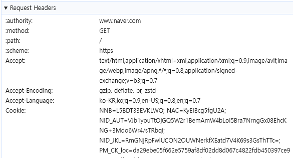
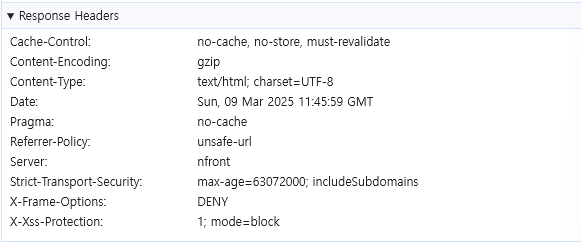
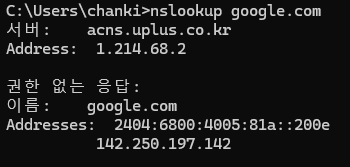
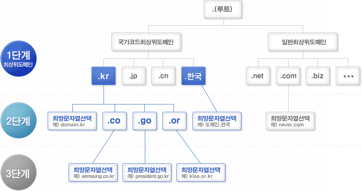
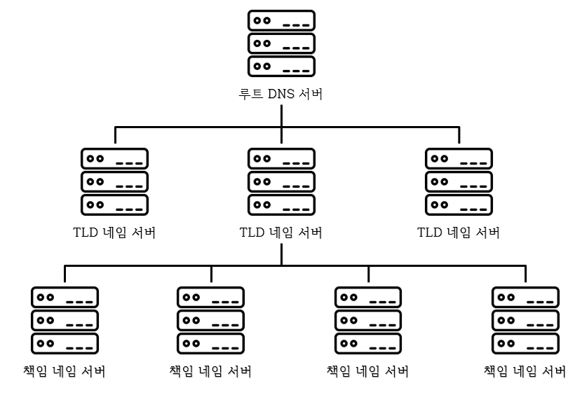
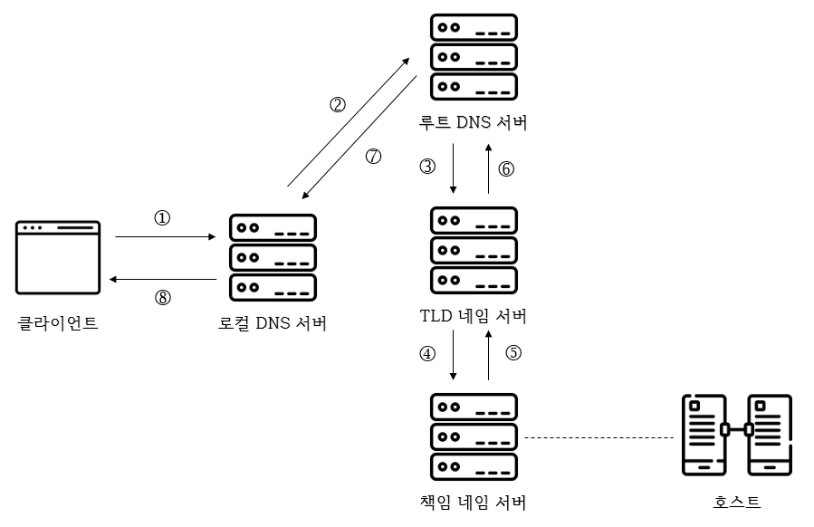
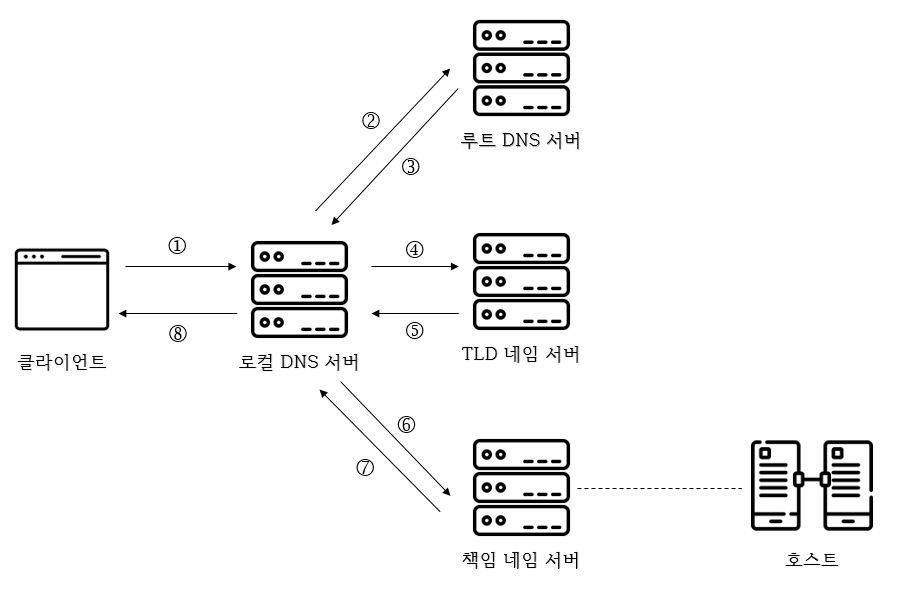
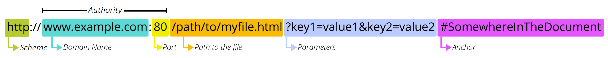

# 1주차

---

브라우저에 url을 입력하면, 브라우저에서 url(웹 서버)에 요청을 보낸다. → 동작 흐름에 따라 조사하기

---
# 동작 과정

### 1. 클라이언트가 주소창에 URL 입력
### 2. 브라우저가 URL 파싱 → URL 구조 해석
1. 어떤 프로토콜로 URL을 요청할 것인가
2. 어떤 도메인을 요청할 것인가
3. 어떤 포트로 요청할 것인가
### 3. DNS 조회 → IP 주소 획득
### 4. 획득한 IP 주소를 활용하여 소켓 생성 후 TCP 연결
- 3-Way Handshake 수행
    ```
    [클라이언트 -> 서버] SYN -> 접속 요청
    [서버 -> 클라이언트] SYN + ACK -> 요청 수락
    [클라이언트 -> 서버] ACK -> 응답 확인
  -> 데이터 송수신 가능!
    ```
### 5. HTTP 요청 전송 (Request)
1. HTTP Request 메시지 구조

        <Method> <Path> <HTTP Version>
        Headers
        
        -----
        GET /example HTTP/1.1
        Host: www.naver.com
        User-Agent: Mozilla/5.0 ~
        Accept: text/html,application/xhtml+xml ~
        ...

2. Request 헤더

    

### 6. 웹 서버 응답 (Response)
1. HTTP Response 메시지 구조

        <HTTP Version> <Status code> <Status message>
        Headers
        
        -----
        HTTP/1.1 200 OK
        Date: Sun, 09 Mar 2025 11:45:59 GMT
        Server: nfront
        ...

2. Response 헤더

   

### 7. 브라우저 렌더링 → 화면 표시

# IP 주소

각 컴퓨터가 갖는 고유한 주소로, 통신에서 대상을 식별하기 위한 값으로 사용된다.

ex) 142.250.197.142 (google.com)



→ 해당 IP주소를 주소창에 입력해도 google.com으로 접속된다.

→ 모든 대상의 IP 주소를 외우고 다닐 수는 없다. → IP 주소에 대응되는 도메인 네임을 사용

# DNS (Domain Name System)

도메인 네임을 대응되는 IP 주소로 변환해주는 시스템

## 도메인 구조



출처: [https://한국인터넷정보센터.한국/jsp/resources/domainInfo/domainInfo.jsp](https://xn--3e0bx5euxnjje69i70af08bea817g.xn--3e0b707e/jsp/resources/domainInfo/domainInfo.jsp)

.(루트)을 기준으로 계층적으로 이루어진다.

→ www.google.com. 으로 접속해도 정상적으로 접속되지만 일반적으로 루트 도메인은 생략한다.

- . → 루트 도메인
- com → 최상위 도메인
- google → 2단계 도메인
- www → 3단계 도메인
- www.google.com. → 전체 주소 도메인 네임(FQDN)

## 도메인 네임

외우기 어려운 IP 주소 대신 각각의 IP주소와 대응되는 문자열로 이루어진 주소

ex) [www.naver.com](http://www.naver.com)

→ IP 주소를 전화번호라 할 때, 도메인 네임은 저장된 이름으로 생각할 수 있음 (물론 하나의 도메인 네임에는 하나의 IP 주소만 대응될 수 있음)

도메인 네임과 IP 주소는 네임 서버에서 관리한다. → 도메인 네임을 관리하는 네임 서버 = DNS 서버

## DNS 서버

도메인 네임을 네임 서버에 질의하면 해당 도메인 네임에 해당하는 IP 주소를 알려준다.

### 종류

DNS 서버도 도메인과 마찬가지로 계층적인 구조로 이루어져 있다.



- 로컬 네임 서버 (로컬 DNS 서버, 리졸버) → 각 통신사의 DNS 서버
    - 클라이언트가 도메인 네임을 통해 IP 주소를 찾을 때, 가장 먼저 찾게 되는 서버이다.
- 책임 네임 서버 → naver, google 등 관리
- TLD 네임 서버 → net, com, kr 등 관리
- 루트 네임 서버 (루트 DNS 서버) → 루트 도메인 관리
    - 전 세계에 13대만 존재한다.
    - 로컬 DNS 서버가 IP 조회 시, 가장 먼저 요청하는 DNS 서버이다.

## DNS 조회 (도메인 네임 리졸빙)

주소창에 도메인 네임을 입력하면 로컬 DNS 서버는 각 DNS 서버들에게 질의하여 IP 주소를 알아낸다.

로컬 DNS 서버가 질의하는 방법은 **재귀적 질의**와 **반복적 질의** 두 가지로 구분된다.

### 재귀적 질의

클라이언트 → 로컬 DNS 서버 → 루트 DNS 서버 → TLD 네임 서버 → 책임 네임 서버 순으로 질의하여 질의 순서의 역순으로 최종 응답 결과를 전달받는다.

### 반복적 질의

클라이언트가 로컬 DNS 서버에 질의하면 로컬 DNS 서버는 각 DNS 서버에게 질의 후, 다음으로 질의할 네임 서버의 주소를 응답받고 그 다음 DNS 서버에게 다시 질의하는 과정을 반복하여 최종 응답 결과를 클라이언트에게 전달한다.

### DNS 캐시

위 질의 과정을 매번 반복하기에는 시간이 오래 걸리고 네트워크 상의 메시지 수가 지나치게 많아진다는 단점이 존재한다. 따라서 실제로는 각 단계에서 DNS 서버들은 기존 응답 결과를 저장한 후, 동일한 질의가 올 경우 다음 DNS 서버에 질의하지 않고 저장된 결과를 응답한다.

# URI (Uniform Resource Identifier)

통신에서 대상을 식별하기 위해서는 IP 주소(도메인 네임)를 활용하고, 정보를 식별하기 위해서는 URI를 활용한다.

- 여기서의 정보 = 자원(resource) → HTML 파일, 이미지, 동영상 등

URI는 말 그대로 자원을 식별하는 통일된 방식을 의미한다.

자원의 **위치를 이용해 식별하는 방법을 URL**이라 하고, **이름을 이용해 식별하는 방법을 URN**이라 한다.

→ URL이 더 많이 사용된다.

## URL (Uniform Resource Locator)


출처: [https://velog.io/@liankim/URL의-구조](https://velog.io/@liankim/URL%EC%9D%98-%EA%B5%AC%EC%A1%B0)
- schema (protocol)
    - 자원에 접근하는 방법을 의미한다.
    - 일반적으로 사용할 프로토콜을 명시한다.
- authority
    - 호스트를 특정할 수 있는 정보이다. (IP 주소 / 도메인 네임 등)
    - 콜론 뒤에 port를 붙일 수 있다.
- path
    - 자원이 위치한 경로를 명시한다.
- query (parameter)
    - URL 구문만으로 자원의 위치를 식별하기에는 정보가 부족할 경우, 추가적인 정보를 전달하기 위해 사용된다.
    - ?key1=value1&key2=value2 형식으로 작성한다.
- fragment (anchor)
    - 자원의 일부분을 가리키기 위한 정보이다.
    - HTML 파일과 같은 자원에서 특정 부분을 가리키기 위해 사용된다.
        - https://datatracker.ietf.org/doc/html/rfc3986
        - https://datatracker.ietf.org/doc/html/rfc3986#section-1.1.2

# Socket

DNS 조회로 얻은 IP주소를 활용하여 서버와 연결하고 데이터를 주고받는 인터페이스이다.

→ 도메인 없이는 소켓 통신 불가능? → 직접적인 IP 주소를 가지고 가능 → 불편

소켓 라이브러리 내부에는 DNS 리졸버가 내장되어 있다. → DNS 리졸버를 실행하여 IP 주소를 얻어 소켓 생성 후 서버에 연결한다.

### GPT 예시 코드

```java
import java.io.*;
import java.net.*;

public class HttpSocketExample {
    public static void main(String[] args) {
        try {
            // 1️⃣ DNS 조회: 도메인을 IP 주소로 변환
            String domain = "www.naver.com";
            InetAddress ipAddress = InetAddress.getByName(domain);
            System.out.println("Naver IP 주소: " + ipAddress.getHostAddress());

            // 2️⃣ 소켓 생성 및 서버와 연결 (포트 80: HTTP)
            Socket socket = new Socket(ipAddress, 80);
            System.out.println("서버와 연결 성공!");

            // 3️⃣ HTTP 요청 메시지 작성 및 전송
            PrintWriter out = new PrintWriter(socket.getOutputStream(), true);
            out.println("GET / HTTP/1.1");
            out.println("Host: " + domain);
            out.println("Connection: close");
            out.println(); // 요청 끝

            // 4️⃣ 서버 응답 받기
            BufferedReader in = new BufferedReader(new InputStreamReader(socket.getInputStream()));
            String responseLine;
            while ((responseLine = in.readLine()) != null) {
                System.out.println(responseLine);
            }

            // 5️⃣ 소켓 종료
            in.close();
            out.close();
            socket.close();
            System.out.println("연결 종료");

        } catch (UnknownHostException e) {
            System.out.println("DNS 조회 실패: " + e.getMessage());
        } catch (IOException e) {
            System.out.println("소켓 연결 실패: " + e.getMessage());
        }
    }
}

```

# 프로토콜 스택
[프로토콜 스택과 메시지의 송신 과정](https://cl8d.tistory.com/68)

[프로토콜 스택](https://cl8d.tistory.com/69)

→ 이해가 잘… 나중에 다시 보자

---

- [https://velog.io/@gyumin_2/브라우저-동작-원리-주소창에-URL-입력-시-일어나는-과정배경지식-편](https://velog.io/@gyumin_2/%EB%B8%8C%EB%9D%BC%EC%9A%B0%EC%A0%80-%EB%8F%99%EC%9E%91-%EC%9B%90%EB%A6%AC-%EC%A3%BC%EC%86%8C%EC%B0%BD%EC%97%90-URL-%EC%9E%85%EB%A0%A5-%EC%8B%9C-%EC%9D%BC%EC%96%B4%EB%82%98%EB%8A%94-%EA%B3%BC%EC%A0%95%EB%B0%B0%EA%B2%BD%EC%A7%80%EC%8B%9D-%ED%8E%B8)
- [https://velog.io/@gyumin_2/브라우저-동작-원리-주소창에-URL-입력-시-일어나는-과정-백엔드-편](https://velog.io/@gyumin_2/%EB%B8%8C%EB%9D%BC%EC%9A%B0%EC%A0%80-%EB%8F%99%EC%9E%91-%EC%9B%90%EB%A6%AC-%EC%A3%BC%EC%86%8C%EC%B0%BD%EC%97%90-URL-%EC%9E%85%EB%A0%A5-%EC%8B%9C-%EC%9D%BC%EC%96%B4%EB%82%98%EB%8A%94-%EA%B3%BC%EC%A0%95-%EB%B0%B1%EC%97%94%EB%93%9C-%ED%8E%B8)
- https://playcode.tistory.com/89
- [URL이란?](https://developer.mozilla.org/ko/docs/Learn_web_development/Howto/Web_mechanics/What_is_a_URL)
- [URI와 URL의 차이](https://www.elancer.co.kr/blog/detail/74)
- [도메인 네임이란](https://developer.mozilla.org/en-US/docs/Learn_web_development/Howto/Web_mechanics/What_is_a_domain_name)
- 혼자 공부하는 네트워크 (Chap 5-1. DNS와 자원)
- ChatGPT