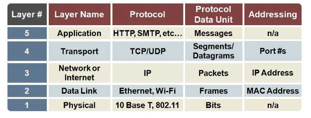

# 1주차

# 1. 개념 정리

## 1.1 HTTP

### 1.1.1 HTTP란?

- **Hypertext Transfer Protocol**
- HTML과 같은 하이퍼미디어 문서를 전송하기 위한 애플리케이션 계층 프로토콜
- HTTP는 웹에서 이루어지는 모든 데이터 교환의 기초이며 클라이언트 서버 프로토콜이기도 함
- 하나의 완전한 문서는 텍스트, 레이아웃 설명, 이미지, 비디오, 스크립트 등 불러온 (fetched) 하위 문서들로 재구성 함

### 1.1.2 HTTP Request & **Response**

- 클라이언트와 서버들은 개별적인 메시지 교환에 의해 통신함
- Request → 보통 브라우저인 클라이언트에 의해 전송되는 메시지
- Responses → Request에 대해 서버에[서 응답으로 전송되는 메시지

[참고자료](https://developer.mozilla.org/ko/docs/Web/HTTP/Overview)

### **1.1.3 HTTP의 특징**

- **비연결 지향(Connectionless)**:
    - 클라이언트가 요청을 보내고 서버가 응답을 반환한 후, 연결이 끊어짐.
    - 이를 해결하기 위해 **Keep-Alive**(연결 유지) 기능이 추가됨.
- **무상태(Stateless)**:
    - 서버는 클라이언트의 이전 요청 정보를 기억하지 않음.
    - 이를 보완하기 위해 **쿠키(Cookie)와 세션(Session)**, **JWT** 등이 사용됨.

## 1.2 IP 주소 & DNS

### 1.2.1 IP 주소

- **Internet Protocol Address**
- **IP 주소**는 인터넷에 연결된 각 장치를 식별하는 고유한 번호로 일종의 “컴퓨터 주소” 역할을 함
- **IPv4, IPv6**: IPv4(32비트)와 IPv6(128비트)로 IP 주소 공간이 다름

### 1.2.2 DNS

- Domain Name System
- IP 주소는 숫자로 이루어져 있기 때문에 사람이 이해하기 쉬운 도메인을 사용
- DNS는 브라우저가 인터넷 자원을 로드할 수 있도록 도메인 이름을 IP 주소로 변환함
- **도메인 계층 구조:**
    - 루트 DNS(`.`)
    - 최상위 도메인(TLD, `.com`, `.org`, `.net`)
    - 2차 도메인(`example.com`)
    - 서브도메인(`blog.example.com`)
- **권한(Authoritative) DNS 서버와 재귀(Recursive) DNS 서버**
    - 권한 DNS 서버는 특정 도메인에 대한 최종 IP 정보를 보유
    - 재귀 DNS 서버는 여러 DNS 서버를 거쳐 최종 IP를 찾음
- **DNS 보안 (DNSSEC)**
    - DNS 데이터의 위변조를 방지하는 보안 확장 기능

[참고자료](https://www.cloudflare.com/ko-kr/learning/dns/what-is-dns/)

## 1.3 소켓

### 1.3.1 소켓이란?

- Socket
- 네트워크 통신의 종단점 (IP 주소 + 포트 번호)
    - 포트번호
        - 각 응용프로그램의 식별번호
        - 어떠한 프로세스가 어떠한 프로세스에게 보내는 데이터인지 정보를 확인하는 용도
- 소켓 프로그래밍
    - 소켓을 만들고 통신하고 소켓을 없애는 과정
    - 네트워크 프로그래밍에서 클라이언트와 서버 간의 데이터 송수신을 위해 사용됨
- 소켓 인터페이스
    - 운영체제가 제공하는 API로, TCP/IP를 통해 통신하는 프로그램들이 이를 활용함

[참고자료](https://velog.io/@emplam27/CS-%EA%B7%B8%EB%A6%BC%EC%9C%BC%EB%A1%9C-%EC%95%8C%EC%95%84%EB%B3%B4%EB%8A%94-%EB%84%A4%ED%8A%B8%EC%9B%8C%ED%81%AC-%EC%86%8C%EC%BC%93-%ED%94%84%EB%A1%9C%EA%B7%B8%EB%9E%98%EB%B0%8D%EA%B3%BC-Handshaking)

## 1.4 프로토콜 스택

### 1.4.1 프로토콜 스택이란?

- 계층화된 구조(스택 구조)로 모여 있는 프로토콜의 집합을 의미함
- Protocol Suite 또는 Protocol Family라 불리기도 함
- 프로토콜 스택의 레이어

### 1.4.2 Transmitting Data

- Application Layer
    - 메시지를 생성하여 Transport Layer로 전송
- Transport Layer
    - 소스 및 대상 포트 주소를 포함하는 TCP 또는 UDP 헤더를 추가함
    - TCP에 사용되는 패킷 시퀀스 번호와 같은 추가 정보도 헤더에 추가됨
    - 생성된 데이터가 TCP를 사용하는 경우 세그먼트라고 하며 UDP를 사용하는 경우는 데이터그램이라고 함
    - 생성된 데이터를 네트워크 계층으로 전송
- Network Layer
    - 네트워크 계층은 소스 및 대상 IP 주소를 포함하는 헤더를 추가하여 패킷을 생성 후 데이터 링크 계층으로 전송
- Data Link Layer
    - 데이터 링크 계층은 MAC 주소가 포함된 헤더를 추가하여 프레임을 만든 후 물리 계층으로 전송함

### 1.4.3 Receiving Data

- Data Link Layer
    - 데이터 링크 계층에서 수신된 대상의 MAC 주소가 자체 MAC 주소와 비교됨
    - 수신된 데이터가 해당 호스트에 대한 것이 아니면 즉시 삭제
    - 일치할 경우 헤더가 제거되고 페이로드가 다음 계층으로 전달
- Network Layer
    - 대상 IP 주소가 자체 IP 주소와 일치하는지 확인
    - 일치할 경우 헤더가 제거되고 페이로드가 다음 계층으로 전달
- Transport Layer
    - 대상 포트 번호가 80인 호스트에서 실행 중인 프로세스가 있는지 확인
    - 확인 후 헤더가 제거되고 메시지가 애플리케이션 계층의 프로세스 번호 80으로 전송
- Application Layer
    - 프로세스 번호 80은 HTTP 서버에서 실행되는 함수임
    - 함수를 실행하면 애플리케이션에서 다른 애플리케이션으로 메시지 전송 프로세스가 완료됨

[참고자료](https://developerhelp.microchip.com/xwiki/bin/view/applications/tcp-ip/five-layer-model-and-apps/#HTCP2FIPFive-LayerSoftwareModelOverview)

### **1.4.4 TCP vs UDP**

- **TCP(Transmission Control Protocol)**
    - 3-way 핸드셰이크(연결 설정)
    - 데이터 순서 보장 및 오류 검출
    - 신뢰성 높은 전송이 필요할 때 사용 (예: 웹 브라우징, 이메일)
- **UDP(User Datagram Protocol)**
    - 비연결형 프로토콜 → 속도가 빠름
    - 데이터 손실 발생 가능
    - 실시간 스트리밍, 게임, VoIP 등에 사용

# 2. URL 입력 후 동작 흐름

### 1. 브라우저에 URL 입력 후 Enter

- 이 예에서 URL은 4개의 부분으로 구성됨
- Scheme -  *http://* . HTTP를 사용하여 서버에 연결을 보내라고 알려줌
- domain -*example.com* 사이트의 도메인 이름
- path - *product/electric* 요청된 리소스인 phone에 대한 서버의 경로

### 2. DNS를 사용하여 도메인 IP 주소 조회

- 조회 프로세스를 빠르게 하기 위해 데이터는 브라우저 캐시, OS 캐시, 로컬네크워크 캐시, ISP 캐시의 여러 계층에 캐시됨

### 2.1 어떤 캐시에서도 IP 주소를 찾을 수 없는 경우

- 브라우저는 DNS 서버로 이동하여 IP 주소를 찾을 때까지 재귀적 DNS 조회를 수행

### 3. 서버의 IP 주소를 획득 후 서버와 TCP 연결을 설정함

- 브라우저가 웹 서버의 IP 주소로 TCP 연결 및 HTTP 요청 전송
- 브라우저는 소켓을 열어 서버 측 소켓에 접속을 요청하며 이때 규약은 TCP 사용함
- TCP는 신뢰성 있는 데이터 전송을 위해 **3-way 핸드셰이크**라 불리는 절차를 거쳐 연결을 설정

### 4. 브라우저가 서버에 HTTP 요청을 보냄

- TCP 연결이 맺어지면 브라우저는 준비된 **HTTP 요청 메시지**를 서버로 전송

### 5. 서버가 요청을 처리하고 응답을 다시 보냄

- HTTP 응답 메시지를 작성한 뒤 클라이언트로 전송 →성공  200

### 6. 브라우저가 HTML 콘텐츠를 렌더링

- 일반적인 HTML 문서라면 브라우저의 렌더링 엔진이 이를 파싱하여 DOM을 구축함
- HTML 안에 참조된 추가 리소스가 있다면 개별적으로 새로운 HTTP 요청을 보내어 가져옴

[참고자료](https://blog.bytebytego.com/p/what-happens-when-you-type-a-url)