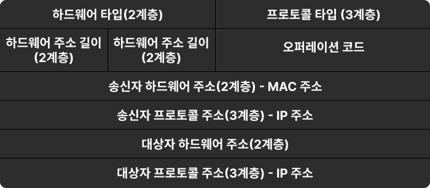

기본적인 데이터 송수신은 분해 → 전송 → 조립 과정을 거친다

- 분해 = 송신 측
    - 각 계층을 내려가며 데이터를 담는 과정 = Encapsulation
    - 데이터를 담는건데 왜 분해? → 세그먼트를 여러 개로 쪼갬
- 조립 = 수신 측
    - 각 계층을 올라가며 데이터를 꺼내는 과정 = Decapsulation

⇒ 데이터 수신은 클라이언트 → 서버의 과정을 반대로 서버 → 클라이언트 과정으로 진행된다.

### 각 계층에서의 데이터 전달


- 애플리케이션 계층

    ```
    [Data] [HTTP Header]
    ```

- 전송 계층

    ```
    [TCP Header 출발지 port, 목적지 port] 
    [Data] [HTTP Header]
    ```

- 인터넷 계층
    - IP 주소는 변하지 않음 (Address Translation 적용 시 변함)

    ```
    [IP Header 출발지 IP 주소, 목적지 IP 주소]
    [TCP Header] [Data] [HTTP Header]
    ```

- 네트워크 인터페이스(액세스) 계층
    - MAC 주소는 출발지와 목적지에 따라 수시로 변할 수 있음
    - MAC 주소는 중간 경로의 주소?

    ```
    [Ethernet Header 출발지 MAC 주소, 목적지 MAC 주소]
    [IP Header] [TCP Header] [Data] [HTTP Header]
    ```


## 애플리케이션 계층

### 소켓 생성

```java
String domain = "www.google.com";
InetAddress ipAddress = InetAddress.getByName(domain); // 도메인 네임을 IP 주소로 변환
Socket socket = new Socket(ipAddress, 80); 
// 80번 포트로 ip 주소와 TCP 통신을 위한 소켓 생성

Socket socket = new Socket(domain, 80); // 이렇게도 생성 가능
// -> 내부적으로 DNS 조회를 통해 IP 주소 획득 후 소켓 생성함

public Socket(InetAddress address, int port) throws IOException {
    this(address != null ? new InetSocketAddress(address, port) : null,
         (SocketAddress) null, true);
}

public Socket(String host, int port)
    throws UnknownHostException, IOException
{
    this(host != null ? new InetSocketAddress(host, port) :
         new InetSocketAddress(InetAddress.getByName(null), port),
         (SocketAddress) null, true);
}
```

위 코드가 실행되면서 3-way handshake도 일어난다. → 전송 계층에서 일어난다.

## 전송 계층

### 서버 접속

- 3-way handshake


1. 클라이언트 → 서버 - SYN = 서버에게 연결 요청
2. 서버 → 클라이언트 - SYN + ACK = 연결 요청 확인 및 연결 요청에 대한 응답
3. 클라이언트 → 서버 - ACK = 연결 요청 확인에 대한 응답 확인

### 데이터 송신

- 세그먼트 생성
    - 데이터를 여러 개의 세그먼트로 나누어 인터넷 계층으로 전달한다.
    - 출발지/목적지 포트 번호, 시퀀스 번호, ACK 번호, 체크섬 등 포함

## 인터넷 계층

### IP 패킷 생성

전송 계층으로부터 받은 세그먼트에 IP 헤더를 추가하여 패킷을 생성한다.

- 출발지/목적지 IP 주소, 프로토콜(TCP/UDP 구분), 체크섬 등 포함

### 라우팅

라우터를 이용해 IP 패킷이 목적지까지의 최적의 경로를 찾는다.

- 라우터는 다른 네트워크와의 연결점 역할을 한다.
1. 라우터가 패킷을 받으면 목적지로 표시된 IP 주소에 서브넷마스크를 적용하여 네트워크 주소 획득
2. 라우팅 테이블에서 네트워크에 대한 정보를 찾고, 해당 정보에 따라 트래픽 전송

## 네트워크 인터페이스 계층

### 이더넷 프레임 생성

인터넷 계층으로부터 받은 패킷에 MAC 주소를 추가하여 이더넷 프레임을 생성한다.

- IP 주소는 목적지 네트워크를 식별하고, MAC 주소는 장치까지 식별한다.
- 목적지 MAC 주소가 없다면? → ARP(Address Resolution Protocol)을 통해 MAC 주소 확인
    - ARP: IP 주소로 MAC 주소를 알아낸다.

### LAN 어댑터를 통해 서버로 전송

LAN 어댑터가 이더넷 프레임을 물리적 신호로 변환하여 전송한다.

- 스위치, 허브, 라우터 등을 거쳐서 목적지까지 이동한다.
- 목적지에 도착하면 조립(Decapsulation) 과정을 통해 상위 계층으로 전달된다.

## 연결 종료

- 4-way handshake


1. 클라이언트 → 서버 - FIN = 통신 종료 요청
2. 서버 → 클라이언트 - ACK = 통신 종료 요청 확인

   (마지막 전송 끝날 때까지 대기)

3. 서버 → 클라이언트 - FIN = 통신 종료 요청에 대한 응답
4. 클라이언트 → 서버 - ACK = 통신 종료 요청에 대한 응답 확인

---

# TCP

- TCP/IP = TCP와 IP의 결합
    - IP 주소 체계를 따르며 IP 라우팅을 통해 목적지에 도달하고
    - TCP의 특성을 활용해 송신자와 수신자의 논리적 연결 생성 및 신뢰성을 유지하겠다.
- TCP Header의 구성
    - Source Port: 데이터를 보내는 애플리케이션의 포트 번호
    - Destination Port: 데이터를 수신하는 애플리케이션의 포트 번호
    - Sequence Number(SYN): 분할된 데이터의 순서
    - Acknowledgment(ACK): 다음으로 받고 싶은 TCP 세그먼트의 Sequence Number
    - etc.


- 세그먼트 = TCP에서 데이터를 조각내어 전송하는 단위
- 연결 지향적이며 데이터의 순서와 무결성을 보장한다. → 속도가 느리다.
    - 3-way handshake로 연결 / 4-way handshake로 연결 종료

## 특징

### 1. 흐름 제어

송신자가 데이터를 수신자의 처리 속도보다 빠르게 보내지 못하도록 제어한다.

→ 수신자의 버퍼가 넘치지 않도록 전송 속도를 조절하는 방식이다.

→ 버퍼가 가득 차면 데이터 손실 발생

동작 방식

- 슬라이딩 윈도우
    - 수신자의 버퍼 크기(window size)를 송신자에게 알려준다.
    - 송신자는 이 크기를 넘지 않는 범위에서 데이터를 전송한다.

### 2. 혼잡 제어

네트워크가 처리할 수 있는 용량 이상으로 데이터를 보내 네트워크가 혼잡해지는 것을 방지한다.

→ 네트워크가 혼잡해지면 전송 속도를 줄인다.

→ 네트워크가 혼잡할 경우, 패킷 손실률 증가 및 전체적인 네트워크 성능 저하가 발생한다.

동장 방식

- Slow Start
    - 처음에는 윈도우 크기를 작게 하고 ACK 응답이 오면 전송량을 2배 증가시킨다.
- 혼잡 회피
    - 전송 속도를 조금씩 증가시키다가 네트워크 혼잡을 감지하면 전송 속도를 감소시킨다.
- 빠른 재전송과 복구 (Fast Retransmit & Fast Recovery)
    - 중간에 패킷이 손실되면 빠르게 재전송하고 이후의 데이터를 전송하며 복구한다.

# UDP

- UDP Header의 구성
    - Source Port: 출발지 포트 정보
    - Destination Port: 도착지 포트 정보
    - Length: 전체 헤더의 크기 [헤더 + 데이터]
    - checksum


- 데이터그램 = UDP에서 데이터를 전송하는 단위
- 비연결형이며, 데이터의 순서와 무결성을 보장하지 않는다. → 속도가 빠르다.
    - 비연결형이므로 따로 연결 및 종료 과정 X

# ARP (Address Resolution Protocol)

IP 주소를 통해 MAC 주소를 알아내기 위한 프로토콜이다.


ARP 프로토콜 필드 (ARP 헤더 + ARP 데이터)

- 데이터 송신 시 IP 주소는 알고 있지만 MAC 주소를 모른다면? → 2계층(DataLink)에서의 캡슐화 불가능 → ARP를 통해 MAC 주소 획득
1. 출발지에서 ARP 브로드캐스트를 이용해 네트워크 전체에 상대방의 MAC 주소를 물어본다.
2. 목적지가 ARP 브로드캐스트를 받으면 ARP 프로토콜을 이용해 응답한다. → 자신의 MAC 주소를 알려줌 - ARP 유니캐스트
3. 송신자는 MAC 주소를 알았으니 2계층에서의 캡슐화가 가능하다.

→ ARP 브로드캐스트를 매번 하는 것은 너무 비효율적이다. → IP 주소와 MAC 주소를 대응시켜 테이블로 저장한 것이 ARP 테이블

⇒ 약간 DNS 조회랑 비슷한 개념인듯?

# LAN 어댑터

- 컴퓨터나 기기를 유/무선 LAN에 연결하는 물리적 하드웨어 장치이다.
- Network Interface Card(NIC)라고도 한다.
- 데이터를 이더넷 프레임으로 캡슐화하여 송수신하는 역할을 한다.
- 실제 네트워크에서 전송이 가능하도록 디지털 데이터 → 물리적 신호로 변환한다.
- LAN 어댑터마다 고유한 MAC 주소가 할당된다.

# 이더넷

- LAN 내에서 유선으로 데이터를 전송하기 위한 표준 기술이다.
    - 데이터를 전송할 때 이더넷 프레임 단위로 전송한다.

### 이더넷 프레임 구조

- 출발지 MAC 주소
- 목적지 MAC 주소
- EtherType (상위 프로토콜 표시)
- 데이터 (IP 패킷)


---
- https://kangkangsulae.tistory.com/103
- [https://mindnet.tistory.com/entry/네트워크-쉽게-이해하기-22편-TCP-3-WayHandshake-4-WayHandshake](https://mindnet.tistory.com/entry/%EB%84%A4%ED%8A%B8%EC%9B%8C%ED%81%AC-%EC%89%BD%EA%B2%8C-%EC%9D%B4%ED%95%B4%ED%95%98%EA%B8%B0-22%ED%8E%B8-TCP-3-WayHandshake-4-WayHandshake)
- [https://velog.io/@bagt/TCPIP-송수신-구조](https://velog.io/@bagt/TCPIP-%EC%86%A1%EC%88%98%EC%8B%A0-%EA%B5%AC%EC%A1%B0)
- https://aws-hyoh.tistory.com/57
- [https://aws-hyoh.tistory.com/entry/OSI-7-Layer-쉽게-이해하기](https://aws-hyoh.tistory.com/entry/OSI-7-Layer-%EC%89%BD%EA%B2%8C-%EC%9D%B4%ED%95%B4%ED%95%98%EA%B8%B0)
- https://shlee0882.tistory.com/110
- https://docs.tosspayments.com/resources/glossary/tcp
- https://chaeyami.tistory.com/194