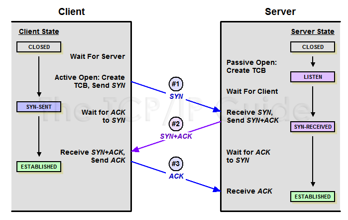

# 2주차

## 1. 키워드 정리

- **TCP(Transmission Control Protocol)**: 연결 지향적, 신뢰성 보장
- **UDP(User Datagram Protocol)**: 비연결형, 속도·효율 중시
- **SYN** : Synchronize Sequence Number
- **IP(Internet Protocol)**: 패킷을 목적지 IP로 라우팅, 비연결·비신뢰성(best-effort)
- **ICMP**: IP 오류 메시지·진단 프로토콜
- **ARP**: IPv4에서 IP→MAC 주소 매핑
- **이더넷(Ethernet)**: LAN에서 프레임 기반 전송, MAC 주소로 식별
- **소켓(Socket)**: 애플리케이션이 TCP/UDP 등을 통해 네트워크와 통신하기 위한 **소프트웨어 인터페이스**

---

## 2. TCP와 UDP의 개념 및 차이점

### 2.1 전송 계층 프로토콜

TCP와 UDP는 **전송 계층(Transport Layer)** 에 속하며 상위 계층(예: HTTP, FTP, DNS 등)에서 내려온 데이터를 **IP 계층**(Network Layer)으로 전달하는 역할을 담당

- **TCP**: RFC 793(1981년)
- **UDP**: RFC 768(1980년)

### 2.2 연결 지향(TCP) vs 비연결형(UDP)

- **TCP**는 데이터를 전송하기 전 **3-way 핸드셰이크**라 불리는 연결 설정 과정을 수행해야 함 → **연결지향**
- **UDP**는 그런 과정 없이 바로 패킷(datagram)을 보내는 **비연결형** 구조로, “전송” 자체에 최소한의 기능만 제공

### 2.3 헤더 구조와 기능 비교

- **TCP 헤더**: 최소 20바이트 이상, SYN/ACK/FIN 플래그, 순서 번호(Sequence Number), 응답 번호(Acknowledgment Number), 윈도우 크기, 옵션 등이 포함되며, 흐름 제어·혼잡 제어 메커니즘을 내장
- **UDP 헤더**: 8바이트로 단순(출발지·목적지 포트, 길이, 체크섬) 신뢰성을 위한 별도 제어 기능 없음

### 2.4 전송 신뢰성 및 순서 보장

- **TCP**:
    - 데이터 손실 시 재전송(ACK 기반), 패킷 순서 뒤바뀜은 순서 번호로 재정렬
    - 흐름 제어(Receiver Window)와 혼잡 제어(Congestion Control)로 네트워크 과부하 방지
    - “데이터 무결성”과 “순서”가 매우 중요할 때 사용
- **UDP**:
    - “최선 노력형(best-effort)” 전송 ACK나 재전송 없음
    - 손실, 중복, 순서 문제 발생 시 프로토콜 자체적으로 해결 불가
    - 상위 계층(애플리케이션)에서 직접 보완해야 함

### 2.5 전송 속도와 효율

- **TCP**: 연결 설정, 재전송, 혼잡 제어 등으로 오버헤드가 커 전송 지연이 상대적으로 길다
- **UDP**: 헤더가 작고 연결 관리가 없어 오버헤드가 최소화되어 전송 지연이 매우 짧다

### 2.6 용도와 활용 사례

- **TCP**: 웹(HTTP/HTTPS), 이메일(SMTP), 파일 전송(FTP)처럼 **데이터 무결성**이 핵심인 곳에 사용
- **UDP**: 실시간 스트리밍(영상·음성), VoIP, 온라인 게임, DNS, DHCP 등 **지연 최소화** 혹은 **단순 요청-응답**이 중요한 곳

---

## 3. TCP 연결: 3-way 핸드셰이크와 4-way 종료

### 3.1 TCP 3-way 핸드셰이크(연결 설정)

1. **SYN** (클라이언트→서버): 클라이언트가 서버로 접속 요청(SYN 플래그=1) 전송 → 상태: SYN_SENT  + 초기 시퀀스 번호 SEQ
    - SYN_SENT : 클라이언트가 SYN을 보내놓고 서버의 응답을 받지 못한 상태
2. **SYN+ACK** (서버→클라이언트): 서버가 SYN 수신을 확인(ACK)하며 자신도 SYN을 보내 연결 수립 의사 표시 → 상태: SYN_RCVD
    - SYN_RCVD :  서버가 통신을 수락하여 **SYN+ACK**(응답) 세그먼트를 클라이언트로 보냄
3. **ACK** (클라이언트→서버): 서버의 SYN에 대한 ACK을 마지막으로 보내면 연결 확립(ESTABLISHED)
    - **3단계**가 필요한 이유: 서버가 클라이언트 SYN에 대한 ACK와 자신의 SYN을 **동시에**(SYN+ACK) 전송하여 **두 과정을 하나로 결합**하기 때문

### 3.2 TCP 연결 종료(4-way 핸드셰이크)

TCP는 전이중(full-duplex)이므로 **각 방향**별로 FIN/ACK 교환이 필요하여 총 4단계가 발생

1. **FIN** (클라이언트→서버): 클라이언트 측 송신 종료 의사
2. **ACK** (서버→클라이언트): 서버는 클라이언트 FIN 수신을 확인
3. **FIN** (서버→클라이언트): 서버도 송신 종료 의사
4. **ACK** (클라이언트→서버): 서버 FIN에 대한 ACK으로 서버 측 방향도 종료 양쪽 CLOSED 상태

### 3.3 RST를 통한 비정상 종료

- **RST 플래그**(Reset)는 예외 상황에서 연결을 강제로 끊을 때 사용 정상 종료가 아니므로 FIN 대신 RST를 보내면 즉시 연결이 해제됨

---

## 4. UDP 전송 과정 및 특성

### 4.1 단순 헤더 구조와 비연결형 전송

- **UDP(User Datagram Protocol)는** 8바이트 고정 헤더(출발지/목적지 포트, 길이, 체크섬)만 가지고 **연결 설정 없이** 데이터를 전송
- 첫 패킷부터 즉시 전송 가능하므로 지연 시간이 매우 짧다

### 4.2 신뢰성 부재와 응용 계층에서의 보완

- **재전송**, **흐름 제어**, **혼잡 제어**, **순서 보장**이 없어 손실이나 순서 뒤바뀜이 발생해도 UDP 스택 자체는 관여하지 않는다
- 필요하다면 **애플리케이션 레벨**에서 보완 논리를 구현해야 한다(예: 자체 시퀀스 번호, 응답 패킷 등)

### 4.3 실시간 전송(스트리밍, VoIP, 게임)에 적합

- **빠른 전송, 지연 최소화**가 중요한 실시간 서비스에 널리 쓰임
- 가령 음성/영상 스트리밍의 경우 약간의 패킷 손실은 허용할 수 있지만 지연이 크면 치명적인 품질 저하로 이어지므로 UDP를 선호

### 4.4 간단한 트랜잭션(DNS, DHCP) 활용

- **DNS 조회, DHCP 등** ‘질의-응답’ 구조가 단순하고 빠른 처리가 중요한 프로토콜이 UDP 위에 구현되어 있다

---

## 5. IP 프로토콜 동작과 라우팅

### 5.1 네트워크 계층에서의 패킷 포워딩

- **IP(Internet Protocol)는** **출발지 IP→목적지 IP** 경로에서 패킷을 전달하는 역할
- 비연결성, 비신뢰성(**best-effort**) IP 계층 자체에는 재전송 메커니즘이 없다

### 5.2 IP 주소 체계(IPv4 vs IPv6)

- **IPv4**: 32비트 주소(예: 192.168.0.10) 주소 부족 문제 → NAT, 사설 IP 사용
- **IPv6**: 128비트 주소, 대량의 주소 공간 제공
- 패킷은 IP 헤더에 목적지 IP를 포함해 네트워크를 거쳐 전달된다

### 5.3 라우팅 테이블과 기본 게이트웨이

- 라우터 혹은 호스트는 **라우팅 테이블**을 기반으로, 목적지 IP가 속한 네트워크를 찾아 **다음 홉(Next Hop)으로** 패킷을 포워딩한다
- 호스트는 보통 “**기본 게이트웨이(Default Gateway)**”를 통해 외부 네트워크와 통신

### 5.4 TTL(Time To Live)을 통한 루프 방지

- IP 패킷은 **TTL** 값을 1씩 감소시키며 0이 되면 폐기된다(라우팅 루프 방지)
- TTL이 0되어 폐기되면 **ICMP Time Exceeded** 메시지가 송신자에게 돌아간다

---

## 6. ICMP(Internet Control Message Protocol)

### 6.1 IP 패킷 내 오류·진단 메시지 프로토콜

- **ICMP**는 IP 패킷에 포함되어 전달되며 네트워크 오류나 상태 정보를 원래 송신자에게 알린다
- 네트워크 계층의 보조 프로토콜로 RFC 792 등에 정의되어 있다

### 6.2 Destination Unreachable, Time Exceeded 등

- 라우터나 호스트가 IP 패킷 전달 불가능 시 **ICMP Destination Unreachable**을 보낸다
- 패킷 TTL이 0으로 소진되면 **Time Exceeded** 메시지를 통해 송신자에게 알림

### 6.3 Echo Request/Reply(핑, ping)와 트레이서트(traceroute)

- **핑(ping)**: ICMP Echo Request를 보내고 Echo Reply 응답 여부 및 왕복 시간을 측정 → 대상 호스트가 살아 있는지 지연은 어느 정도인지 확인
- **트레이서트(traceroute)**: TTL을 단계적으로 늘려가며 각 홉에서 발생하는 ICMP Time Exceeded 메시지로 경로상의 라우터 목록과 지연을 확인

---

## 7. ARP(Address Resolution Protocol)

### 7.1 IP→MAC 주소 매핑 필요성

- LAN(이더넷)에서 데이터 전송 시 목적지 MAC 주소가 필요 그러나 IP와 MAC은 별개이므로 변환(매핑) 과정이 필요

### 7.2 ARP 요청/응답 흐름과 캐싱(ARP 테이블)

1. **ARP 요청**(브로드캐스트): 특정 IP 주소를 가진 호스트 한테 MAC 주소 요청
2. **해당 IP의 호스트**가 ARP 응답(유니캐스트)으로 자신의 MAC을 알려준다
3. 송신자는 **ARP 테이블**에 IP→MAC 정보를 캐싱하고, 이후부터 목적지 MAC을 바로 사용해 프레임을 전송

### 7.3 브로드캐스트·유니캐스트 전송 차이

- ARP 요청은 LAN의 **모든 장치**가 수신(브로드캐스트)
- ARP 응답은 요청을 보낸 호스트의 MAC 주소만을 목적지로 **유니캐스트** 전송

---

## 8. 이더넷(Ethernet) 프레임 구조와 LAN 어댑터(NIC)

### 8.1 이더넷 프레임 형식

1. **목적지 MAC 주소(6B)**
2. **출발지 MAC 주소(6B)**
3. **EtherType(2B) 혹은 길이**
4. **데이터(payload, 46~1500B)**
5. **FCS(4B)**: 프레임 오류 검출용 CRC

### 8.2 MAC 주소의 역할

- 48비트(6바이트)로 구성된 물리 주소 전 세계에서 유일하게 할당
- 이더넷 스위치·NIC는 **MAC 주소**를 통해 어떤 포트로 프레임을 전달할지 결정한다

### 8.3 CSMA/CD 기반 전송(충돌 감지)

- 전통적 이더넷은 공유 매체에서 충돌(collision)을 감지하면 재전송
- 현대에는 스위치를 통해 물리적으로 분할되어 충돌이 크게 줄었으나 개념적 CSMA/CD 원리는 동일

### 8.4 NIC의 송수신 동작 및 프로토콜 분기

- **송신**: 상위계층(IP)→NIC 드라이버 목적지 MAC 주소를 받아 **이더넷 프레임** 구성 후 물리 계층으로 송신
- **수신**: 수신한 프레임의 **목적지 MAC**이 자기 것(or 브로드캐스트)이면 NIC가 상위 계층으로 전달
    - EtherType이 0x0800이면 IP 프로토콜, 0x0806이면 ARP 등으로 분기

---

## 9. 소켓(Socket) 개념과 동작

소켓은 **애플리케이션 프로세스**가 네트워크(TCP/UDP 등)와 **데이터를 송수신**하기 위한 **소프트웨어 인터페이스**

- **IP 주소 + 포트 번호**로 식별되는 **네트워크 엔드포인트**
- OS 커널의 TCP/UDP 스택을 통해 실제 패킷 송수신이 이뤄지며, 애플리케이션은 **소켓 API**로 이를 제어

### 9.1 TCP 소켓

1. **서버**
    - socket() → bind(포트 할당) → listen() → accept()
    - **accept()**가 성공하면 **새로운 소켓**이 생성되어 해당 클라이언트 연결을 전담
2. **클라이언트**
    - socket() → connect(서버 IP, 포트)
    - 내부적으로 **3-way 핸드셰이크**가 일어나고 연결이 맺히면 send()/recv() 등의 함수를 통해 바이트 스트림 전송
3. **연결 종료**
    - 한쪽이 close()를 호출하면 내부적으로 **4-way 핸드셰이크**(FIN→ACK→FIN→ACK)로 정상 종료

### 9.2 UDP 소켓

1. **서버**
    - socket() → bind(포트 할당)
    - listen()이나 accept() 단계가 없음 **데이터그램**을 수신할 준비만 되어 있음(recvfrom() 등)
2. **클라이언트**
    - socket() → sendto(서버 IP, 포트, 데이터)
    - **연결 설정**이 없으므로 최초 패킷부터 바로 전송 가능
3. **종료**
    - 비연결형이므로, 단순히 소켓을 close()하면 끝난다
    - 특별한 핸드셰이크 절차 없음

### 9.3 애플리케이션에서의 소켓 활용

- **소켓 버퍼**
    - OS가 관리하는 송·수신 버퍼 send() 호출 시 커널 버퍼에 쌓이고, TCP/UDP 스택을 통해 전송
- **프로토콜 스택 연동**
    - 소켓이 전송 계층(TCP/UDP)과 연결되어 하위로 IP 패킷→이더넷 프레임 순으로 캡슐화됨
    - 애플리케이션은 “소켓 함수”만 부르면 되며 내부 캡슐화(ARP, IP, 이더넷)는 커널이 담당

---

## 10. 정리 및 계층 별 요약

### 10.1 정리

1. **TCP**
    - 연결 지향(3-way handshake), 데이터 무결성·순서 보장, FIN 기반 4-way 종료
    - HTTP/SMTP/FTP 등 **안정적 전송**이 필수인 서비스에 사용
2. **UDP**
    - 비연결형, 지연이 짧고 단순·고속
    - 스트리밍, VoIP, 온라인 게임 등 **실시간성** 중시나 DNS처럼 단순 요청-응답에 유리
3. **IP 계층**
    - 패킷을 **최선 노력**으로 포워딩(비연결), 라우팅 테이블로 경로 결정
    - ICMP 통해 오류(도달 불가 등)나 진단(핑, 트레이서트) 메시지 전달
4. **ARP**
    - IP→MAC 변환(브로드캐스트 요청, 유니캐스트 응답)으로 이더넷 프레임 전송 가능케 함
5. **이더넷**
    - **프레임** 단위 통신, MAC 주소로 목적지 식별
    - LAN 어댑터(NIC)가 프레임 송·수신, EtherType에 따라 IP/ARP 상위 계층으로 분기
6. **소켓(Socket)**
    - 애플리케이션이 **TCP/UDP**를 사용해 네트워크와 통신하기 위한 **엔드포인트**(IP+Port)
    - TCP 소켓은 bind(), listen(), connect(), accept() 등으로 연결 관리, UDP 소켓은 바로 sendto()/recvfrom()로 데이터그램 송수신

### 10.2 계층 별 요약

- **링크 계층(Ethernet, ARP)**
    - 이더넷은 **프레임** 단위 **MAC 주소** 활용
    - ARP는 IP→MAC 변환 (브로드캐스트 요청 / 유니캐스트 응답)
- **네트워크 계층(IP, ICMP)**
    - IP는 **최선 노력** 포워딩, TTL로 패킷 수명 제한
    - ICMP로 오류·진단 정보 교환 (Destination Unreachable, Time Exceeded, Echo/Reply)
- **전송 계층(TCP, UDP)**
    - **TCP**: 연결 지향(3-way) 안정적 데이터 전송(순서·재전송·흐름/혼잡제어)
    - **UDP**: 비연결형 낮은 지연(손실 복구·순서 제어는 상위 계층에 맡김)
- **소켓 (응용 프로그램 ↔ 전송 계층 인터페이스)**
    - TCP/UDP를 사용해 데이터 송수신할 수 있도록 OS 커널과 애플리케이션을 연결해 주는 **소프트웨어 창구**
    - send(), recv()(TCP) 또는 sendto(), recvfrom()(UDP) 등을 통해 데이터 입출력 수행

참고자료
[The Difference Between TCP and UDP Explained](https://www.linode.com/docs/guides/difference-between-tcp-and-udp/#:~:text=They%20receive%20data%20from%20higher,and%20UDP%20in%20RFC%20768)

[TCP_3_way_handshaking - Wireshark Wiki](https://wiki.wireshark.org/TCP_3_way_handshaking#:~:text=2,SENT%20status)

[The three-way handshake via TCP/IP - Windows Server | Microsoft Learn](https://learn.microsoft.com/en-us/troubleshoot/windows-server/networking/three-way-handshake-via-tcpip#:~:text=Frame%204%3A)