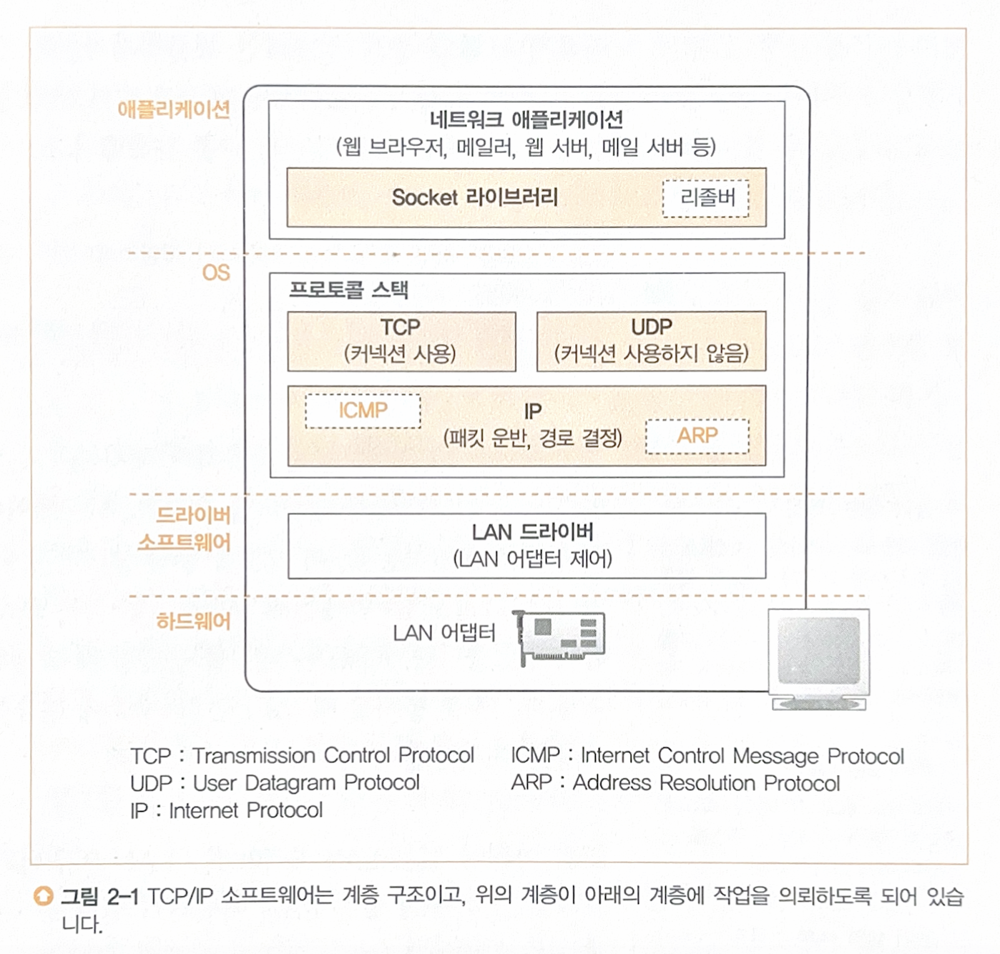

## **TCP/IP 프로토콜 스택** 네트워크 통신 과정

1. 소켓 생성 (애플리케이션 계층)
2. TCP/UDP에 따른 접속 시도 (전송 계층)
3. IP 패킷 생성 및 라우팅 (인터넷 계층)
4. 이더넷 프레임 생성 및 전송 (네트워크 액세스 계층)
5. 서버에서 응답 후 클라이언트로 전달
6. 연결 종료 및 소켓 말소


## 소켓 프로그래밍 기본 구조

```c
sock = socket(AF_INET, SOCK_STREAM, 0);
connect(sock, (struct sockaddr *)&server_addr, sizeof(server_addr));
send(sock, message, strlen(message), 0);
recv(sock, buffer, sizeof(buffer) - 1, 0);
shutdown(sock, SHUT_WR);
close(sock);
```

| 단계 | 메서드 | 설명 | 성공 시 리턴 값 |
| --- | --- | --- | --- |
| **1단계** | `socket()` | 소켓 생성 (TCP or UDP) | 디스크립터 |
| **2단계** | `connect()` | 서버 연결 시도 (3-way handshake) | 0 |
| **3단계** | `send()` | 데이터 전송 | 전송된 바이트 수 |
| **4단계** | `recv()` | 서버에서 응답 수신 | 수신된 바이트 수 |
| **5단계** | `shutdown()` | 송신/수신 종료 | 0 |
| **6단계** | `close()` | 소켓 닫기 (4-way handshake) | 0 |

## 1. 소켓을 작성한다

### 1) 프로토콜 스택의 내부 구성

프로토콜 스택은 **OS에 내장된 네트워크 제어용 소프트웨어**
- **TCP, UDP 프로토콜**: 애플리케이션의 의뢰를 받아 데이터 송수신
- **IP 프로토콜**: 패킷 송수신 동작 제어
    - **ICMP**: 패킷 운반 시 발생하는 오류 및 제어용 메시지 통지
    - **ARP**: IP 주소에 대응하는 이더넷 MAC 주소 조사



### 2) 소켓의 실체는 통신 제어용 제어 정보

프로토콜 스택 내부에는 제어 정보가 기록된다. (통신 상대의 IP주소, 포트번호, 응답 여부, 경과 시간 등)  
본래 소켓은 개념적인 것이어서 실체가 없으므로, 굳이 말하자면 이 **제어 정보가 소켓의 실체**이다.

```bash
>netstat -ano

Active Connections
Proto   Local Address        Foreign Address      State         PID
TCP     118.42.2.212:2477    222.233.53.144:80    ESTABLISHED   1720

* 소켓을 만든다는 것은 여기에 새로 한 행의 제어 정보를 추가하고, 통신을 준비하는 것이다
```

- 프로토콜의 종류
- 로컬측의 IP주소와 포트번호
- 통신 상대측의 IP주소와 포트번호
- 통신 상태
    - LISTENING: 상대의 접속을 기다리는 상태
    - ESTABLISHED: 접속 동작이 끝나고 데이터가 통신중
- 해당 소켓을 사용하는 프로그램의 PID

### 3) Socket을 호출했을 때의 동작

애플리케이션이 `socket`을 호출하면, 프로토콜 스택은 한 개의 소켓을 만든다.
- 파일 디스크립터 할당: 프로세스의 파일 디스크립터 테이블에서 비어 있는 슬롯의 인덱스
- 소켓 구조체 생성: TCP/UDP 등 인자에 따라 세부 설정
- 할당된 디스크립터와 생성된 소켓 구조체 연결
- 커널이 파일 디스크립터 반환
- 프로토콜 스택이 소켓의 제어 정보를 가지고 있기 때문에, 앞으로 디스크립터를 통해 어떤 소켓 식별 가능

---

## 2. 서버에 접속한다

### 1) 접속의 의미

**통신 상대와 제어 정보를 주고받아 소켓에 필요한 정보를 기록**하고 데이터 송수신이 가능한 상태로 만드는 것

- 소켓을 생성한 직후에는 아무것도 기록되어 있지 않으므로 통신 상대가 누군지도 모름.
- 프로토콜 스택에 제어 정보를 전달하고, 서버측의 프로토콜 스택에도 통신하고자 하는 클라이언트가 있다는 것을 알려야 함

### 2) 맨 앞부분에 제어 정보를 기록한 헤더를 배치한다

제어 정보는 크게 두 가지 종류가 있다.
- 패킷 헤더에 부가되는 정보
    - 클라이언트와 서버의 통신을 제어
- 소켓에 기록되는 정보
    - 프로토콜 스택의 동작 제어
    - 상대측에서 볼 수 없다
    - OS마다 프로토콜 스택이 다르기 때문에 제어 정보도 다름

### 3) TCP 접속 과정 (3-way handshake)

- **클라이언트 → 서버 : SYN**
    - `connect(<서버 IP>, <서버 포트>)` 를 호출하여 TCP 헤더를 전송한다.
    - TCP 헤더에 담기는 주요 제어 정보
        - **SYN 비트** → 연결 요청 (SYN = 1)
        - **시퀀스 번호** → 초기 시퀀스 번호 설정
        - **송신 포트, 수신 포트** → 연결할 포트 정보 포함
    - 클라이언트는 대기 상태로 전환된다.
- **서버 → 클라이언트 : SYN + ACK**
    - 서버측의 TCP 담당 부분(TCP stack)은 패킷의 수신처 포트 번호에 해당하는 소켓을 찾는다.
    - 접속을 기다리는 상태의 소켓 중 해당 포트번호의 소켓을 찾아 정보를 기록하고 접속 진행 상태가 된다.
    - 서버의 TCP 담당은 응답을 돌려 보낸다. (**SYN =** 1, **ACK =** 1)
    - 서버는 연결 준비 상태로 전환된다.
- **클라이언트 → 서버 : ACK**
    - **SYN-ACK** 패킷을 확인하고(SYN=1이면 성공), **ACK** 패킷을 서버에 다시 보낸다.
    - 소켓에 서버의 IP 주소와 포트 번호 등 제어 정보를 기록한다.

---

## 3. 데이터를 송수신한다

### 1) 프로토콜 스택에 HTTP 리퀘스트 메시지를 넘긴다

- 애플리케이션이 `write()`를 호출하여 HTTP 요청 메시지를 프로토콜 스택에 전달한다.
- TCP는 데이터를 송신 버퍼에 저장한 뒤, 2가지 요소를 고려하여 다음 데이터를 기다릴지, 전송할지 결정
    - **한 패킷에 저장할 수 있는 데이터의 크기 (MSS)**
    - **타이밍**

| 메커니즘 | 설명 | 목적 |
| --- | --- | --- |
| **버퍼 트리거** | 버퍼가 가득 차면 전송 | 전송 횟수 최소화 |
| **Nagle 알고리즘** | 작은 데이터 모아 전송 | 전송 효율성 개선 |
| **타이머 기반 전송** | 일정 시간 지나면 강제 전송 | 지연 시간 방지 |
| **윈도우 크기 조정** | 수신 측 상태에 따라 속도 조정 | 수신 버퍼 초과 방지 |
| **최적화 전략** | 패킷 크기 최대화 + 지연 최소화 | 전송 효율 + 신뢰성 |

### 2) 데이터가 클 때는 분할하여 보낸다

- TCP는 HTTP 요청 메시지가 MSS보다 크면 여러 개의 세그먼트로 나눈다.
- 나뉜 세그먼트마다 시퀀스 번호(Sequence Number)를 부여
- MSS (Maximum Segment Size)
    - 한 번에 보낼 수 있는 **최대 세그먼트 크기**
    - 일반적으로 이더넷의 MTU(Maximum Transmission Unit)에서 IP와 TCP 헤더 크기를 뺀 값
    - MSS는 보통 1460 바이트

### 3) ACK 번호를 사용하여 패킷이 도착했는지 확인한다

- 송신한 패킷이 상대에게 올바르게 도착했는지 확인하고, 도착하지 않았다면 다시 송신을 하는 확인 동작까지 수행을 해야 한다.
- TCP는 전송 시 **SEQ 번호**를 사용하고, 수신 측에서는 이에 대해 **ACK 번호**로 응답합니다.
    - SEQ 번호: 조각이 통신 시작부터 몇 번째 바이트인지
    - ACK 번호: 수신자가 다음에 받을 것으로 기대하는 시퀀스 번호
- 중간에 패킷이 유실되면, 해당 패킷부터 재전송한다.

### 4) 패킷 평균 왕복 시간으로 ACK 번호의 대기 시간을 조정한다

- TCP는 데이터 송신 시 RTT(ACK 번호가 돌아오는 시간)을 계산하여 동적으로 대기 시간을 설정한다.
- 대기시간이 너무 짧으면 타임아웃이 발생해 재전송 증가 + 네트워크 혼잡 → **비효율**
- 너무 길면 연결 속도가 느려짐 → **속도 저하**

### 5) 윈도우 제어 방식으로 효율적으로 ACK 번호를 관리한다

- TCP는 **흐름 제어**를 위해 **윈도우 크기**를 사용한다.
- **윈도우 제어**: 하나씩 ACK 번호를 기다리지 않고 연속해서 복수의 패킷을 보내는 방법
- 수신 측의 버퍼를 초과하여 패킷을 보내지 않도록
    - 수신 측에서 송신 측에 **수신 가능한 데이터의 양**을 통지한다.
    - 수신 측은 **이 양을 초과하지 않도록 송신 동작을 수행**한다.
- 수신 측은 수신 가능한 최대값(윈도우 사이즈)을 TCP 헤더의 윈도우 필드에 기록하여 송신 측에 알린다.
- 송신 측은 윈도우 필드에 기록된 값을 보고 송신을 결정한다.

### 6) ACK 번호와 윈도우를 합승한다

- 데이터의 패킷을 수신할 때마다 ACK와 윈도우 통지의 패킷이 하나씩 보내지는 것은 비효율적
    - ACK 번호와 윈도우 크기를 같은 헤더에 포함하여 전송한다.
    - 여러 개의 세그먼트를 연속적으로 받을 경우 마지막 세그먼트의 시퀀스 번호에 대해 ACK 응답한다.

### 7) HTTP 응답 메시지를 수신한다

- 서버에서 **HTTP 응답 메시지**가 돌아올 때도 동일한 TCP 흐름을 따른다
    - 서버가 HTTP 응답 메시지를 생성하여 TCP를 통해 전송
    - 클라이언트는 패킷을 수신하고 시퀀스 번호를 확인하여 재조립
    - ACK와 윈도우 크기 정보를 포함한 응답을 서버에 전송
    - 최종적으로 웹 브라우저 등 애플리케이션이 응답을 받아 처리

---

## 4. 서버에서 연결을 끊어 소켓을 말소한다

### 1) 4-Way Handshake

1. **서버 측에서 종료 시작**
    - 서버 애플리케이션이 `close()` 호출
    - 서버의 프로토콜 스택이 FIN 비트를 설정한 TCP 헤더 생성
    - IP 계층에 전달 → 클라이언트에게 **FIN** 전송
    - 서버 소켓 상태를 연결 끊기 진행 중으로 설정
2. **클라이언트 측에서 FIN 수신 → ACK 응답**
    - 클라이언트가 FIN 수신하고, 프로토콜 스택이 FIN 상태 기록
    - 클라이언트에서 ACK 플래그 설정한 TCP 헤더 생성 및 서버에 응답
    - **서버는 자신이 보낼 데이터가 남아 있을 수 있으므로 연결을 완전히 종료하지 않음**
    - 연결이 반쯤 닫힌 상태 (Half-Close 상태)
3. **클라이언트 측에서 데이터 읽기**
    - 클라이언트가 데이터 읽기 대기 상태
    - `read()` 호출 시 남아 있는 데이터 전달
    - 모든 데이터 수신이 끝났음을 애플리케이션에 알림
4. **클라이언트 측에서 종료 완료**
    - 클라이언트 애플리케이션이 `close()` 호출
    - 클라이언트의 프로토콜 스택이 FIN 비트를 설정한 TCP 헤더 생성
    - IP 계층에 전달 → 서버에 FIN 전송
5. **서버 측에서 종료 확인**
    - 서버가 FIN 수신 후 ACK 반환
    - 서버와의 연결 종료

| 단계 | 송신 측 | 수신 측 | 설명 |
| --- | --- | --- | --- |
| 1 | 클라이언트 → 서버 | [FIN, SEQ=x] | 클라이언트가 FIN으로 종료 의사 표시 |
| 2 | 서버 → 클라이언트 | [ACK, SEQ=y, ACK=x+1] | 서버가 FIN 수신 확인 |
| 3 | 서버 → 클라이언트 | [FIN, SEQ=y] | 서버도 FIN 전송 |
| 4 | 클라이언트 → 서버 | [ACK, SEQ=x+1, ACK=y+1] | 클라이언트가 FIN 수신 확인 |

### **2) 상태 변화 과정**

1. **ESTABLISHED :** 연결 상태
2. **FIN_WAIT_1** : 클라이언트가 FIN 전송 후 응답 대기 상태
3. **FIN_WAIT_2** : 서버의 ACK 수신 후 서버의 FIN 대기 상태
4. **TIME_WAIT** : 클라이언트가 서버의 FIN을 수신 후 대기 상태
5. **CLOSED** : 연결 종료

---

## 5. IP와 이더넷 패킷 송수신 동작

### 1) 패킷의 기본

`[Ethernet Header] + [IP Header] + [TCP/UDP Header] + [Data]`

- 패킷은 데이터 통신에서 사용하는 **전송 단위**
    - TCP/UDP에서 만든 데이터를 IP 계층이 **IP 패킷**으로 감싸고
    - IP 패킷을 다시 이더넷 계층에서 **이더넷 프레임**으로 캡슐화함

### 2) 패킷 송수신 동작의 개요

- 애플리케이션이 데이터를 생성하고 소켓을 통해 TCP/UDP에 전달
- TCP/UDP가 데이터를 처리하고 **세그먼트** 생성
- IP 계층이 세그먼트를 받아 **IP 패킷** 생성
- IP 계층이 목적지 MAC 주소를 얻고 **이더넷 프레임** 생성
- 프레임을 LAN 카드가 전기/빛 신호로 변환하여 송출
- 상대방이 수신하고 패킷을 복구 후 TCP로 전달

---

## 6. UDP 프로토콜을 이용한 송수신 동작

### 1) 수정 송신이 필요없는 데이터의 송신은 UDP가 효율적이다

- UDP는 연결이 필요 없는 통신 프로토콜로, 빠르고 단순한 데이터 전송이 필요한 경우에 사용된다
- TCP와는 달리 데이터 전송의 **신뢰성**보다 **전송 속도**가 중요한 경우에 사용된다
- UDP의 특징
    - **연결 없음** → 연결 설정(3-Way Handshake) 불필요
    - **비신뢰성** → 패킷 유실 가능
    - **순서 보장 안 함** → 패킷이 순서대로 도착한다고 보장되지 않음
    - **오버헤드 낮음** → TCP보다 헤더가 단순해서 처리 속도가 빠름
    - **빠름** → 실시간 스트리밍, 게임 등에서 유용
- UDP 헤더 구조 (총 8바이트, 각 16비트)
    - 송신 포트 번호, 수신 포트 번호, UDP 헤더 + 데이터 길이, 체크썸

### 2) 제어용 짧은 데이터

- UDP는 패킷 크기가 작고 **헤더 오버헤드**가 적기 때문에 제어 데이터에 적합하다.
    - NTP, ICMP (ping), Syslog 등
- 오류발생으로 회답이 없다면 같은 데이터를 한번 더 보낸다.

### 3) 음성 및 동영상 데이터

- **흐름 제어**와 **혼잡 제어**를 하지 않기 때문에 속도가 빠르다.
- 약간의 데이터 유실이 있어도 문제없는 경우에 적합하다.
    - 실시간 통화에서 약간의 끊김이나 노이즈보다는 속도가 중요함


---
https://velog.io/@emplam27/CS-%EA%B7%B8%EB%A6%BC%EC%9C%BC%EB%A1%9C-%EC%95%8C%EC%95%84%EB%B3%B4%EB%8A%94-%EB%84%A4%ED%8A%B8%EC%9B%8C%ED%81%AC-%EC%86%8C%EC%BC%93-%ED%94%84%EB%A1%9C%EA%B7%B8%EB%9E%98%EB%B0%8D%EA%B3%BC-Handshaking  
