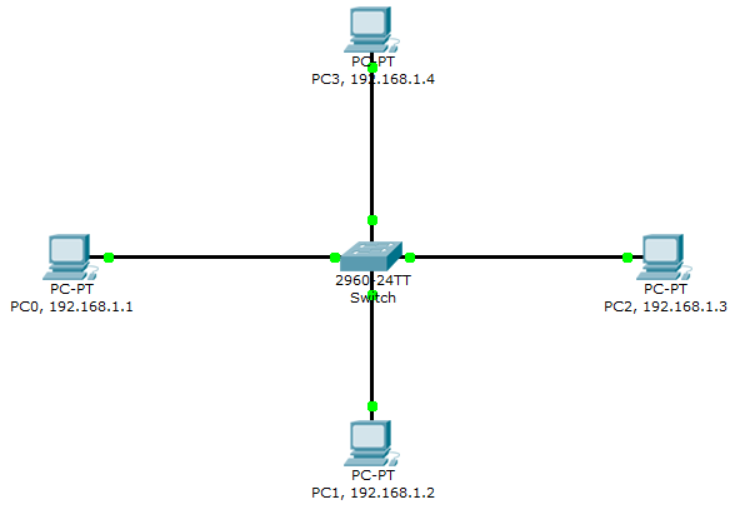

## LAN

네트워크 매체를 이용하여 동일한 서브넷 마스크(같은 IP 대역)를 사용하는 네트워크 매체와 컴퓨터를 묶는 컴퓨터 네트워크를 말한다.

- 동일한 서브넷 마스크를 사용한다 = LAN
- 서브넷 마스크를 얼마만큼 정하느냐에 따라 LAN의 크기(범위)가 달라진다.

→ 소규모 네트워크(집) ~ 중규모 이상의 네트워크(회사, 캠퍼스 등) 범위까지 동일한 IP 대역과 동일한 서브넷 마스크를 이용한다면 모두 LAN이라고 할 수 있다.

→ 해당 네트워크의 모든 단말들은 ARP의 영향을 받으며, LAN 내 모든 단말에 대한 ARP 테이블을 보유한다.



## 케이블과 리피터, 허브 속으로 신호가 흘러간다.

**OSI 1계층 (물리 계층)**

- 컴퓨터에서 송신된 패킷은 중계 장치(허브, 라우터)에 의해 중계되어 목적지로 향한다.
    - 중계 장치는 데이터를 보지 않고 중계만 한다.

      → 데이터나 TCP 헤더가 운반에 영향 X

      → 모든 패킷은 아무 관련 없는 별개의 것으로 간주하고 목적지를 향해 중계된다.

1. LAN 어댑터가 디지털 데이터를 전기 신호로 변환하여 케이블에 전송한다.
    1. 일정 거리를 넘어가면 신호가 약해진다. → 중계 장치 필요
2. 약해진 신호를 리피터가 받아 재생(증폭)시킨다.
    1. 들어온 신호를 그대로 출력
3. 리피터 허브는 받은 신호를 연결된 모든 포트에 전송한다.
    1. 충돌이 자주 발생한다.
    2. MAC 주소를 관리하지 않는다. → 출발지, 목적지 정보 X

## 스위칭 허브가 패킷을 중계한다.

**OSI 2계층 (데이터 링크 계층)**

1. 스위칭 허브는 MAC 주소를 기반으로 하여 목적지 포트에만 신호를 전송한다.
    1. 충돌이 적다.
    2. 출발지, 목적지 정보 O
2. MAC 주소 테이블을 등록 및 갱신한다.
    1. 패킷 수신 시 출발지 MAC 주소와 해당 패킷이 들어온 포트 번호를 MAC 주소 테이블에 저장한다.
    2. 해당 패킷의 목적지 MAC 주소를 확인한다.
3. 패킷 전송
    1. MAC 주소가 테이블에 없다면 브로드캐스트를 통해 모든 포트로 전송한다.
    2. MAC 주소가 테이블에 있다면 유니캐스트를 통해 해당 포트로만 전송한다.
    3. 출발지 포트와 목적지 포트가 같다면 패킷을 폐기한다.

### MAC 주소 테이블

(MAC 주소 - 포트 번호)를 저장하는 스위치 내부의 테이블이다.

→ 이 테이블을 통해 스위치가 어느 장치가 어느 포트에 연결되었는지 기억한다.

## 라우터가 패킷을 중계한다.

**OSI 3계층 (네트워크 계층)**

라우터는 서로 다른 네트워크 간 IP 패킷을 전달한다. → 중계 부분과 포트 부분으로 구성된다.

- 중계 부분: 패킷의 중계 대상을 판단한다.
- 포트 부분: 패킷을 송/수신한다.
1. 내부 네트워크 장치로부터 IP 패킷을 전달받는다.
    1. 출발지 IP 주소와 목적지 IP 주소를 담고있다.
2. 라우팅 테이블에 등록된 정보에 의해 중계 대상을 판단하여 패킷을 중계한다.
    - 라우팅 테이블

   | 목적지 네트워크 | 넥스트 홉 | 인터페이스 | 메트릭 |
       | --- | --- | --- | --- |
   | 192.168.1.0/24 | 직접 연결됨 | eth0 | 1 |
   | 10.0.0.0/8 | 192.168.1.254 | eth1 | 2 |
   | 0.0.0.0/0 | 192.168.1.1 | eth0 | 10 |
    - 목적지 네트워크: 패킷의 목적지 IP가 속한 네트워크 대역
    - 넥스트 홉: 패킷을 전달할 다음 라우터(게이트웨이) 주소
    - 인터페이스: 어떤 포트를 통해 보낼 것인가
    - 메트릭: 경로의 비용 → 낮을수록 우선
3. 경로 선택 및 패킷 전송
    1. 패킷의 목적지 IP주소를 확인하고 가장 효율적인 경로로 패킷을 전송한다.
    - 직접 연결된 네트워크일 경우 → 바로 해당 포트로 보낸다.
    - 다른 네트워크일 경우 → 다음 라우터(넥스트 홉)에게 넘겨준다.

### ❓게이트웨이란

출입구 역할을 하는 네트워크 장비이다. → 내부 네트워크에서 외부 네트워크로 나갈 때 거쳐야 하는 관문

→ 다른 네트워크로 나갈 때는 게이트웨이에게 어디로 보내야 하는지 물어본다.

---

## 스위치와 라우터 차이

둘 다 패킷을 중계하는데 무슨 차이일까?

| 스위치 | 라우터 |
| --- | --- |
| 동일 네트워크 간 연결 → 내부 장치 간 통신 | 서로 다른 네트워크 간 연결 → 외부와의 통신 |
| MAC 주소를 기반으로 패킷 중계 | IP 주소를 기반으로 패킷 중계 |
| 필요 시 브로드캐스트 수행 (MAC 주소 없을 경우) | 브로드캐스트 수행 X |

## 서브넷

Subnet = Sub + Network = 네트워크를 나눈 것

→ 하나의 큰 IP 네트워크를 여러 개의 작은 네트워크로 나눈 것

why? 네트워크를 효율적으로 관리하고 브로드캐스트 범위를 줄이기 위해서

### IP의 특징

IP는 네트워크 부분 + 호스트 부분으로 구성된다.

- 하나의 브로드캐스트 도메인에 있는 IP끼리 통신하려면 네트워크 영역이 같으면서 호스트 영역은 달라야 한다. → 호스트가 같으면 IP 충돌

→ 네트워크 영역이 다르면 통신이 불가한가? NO

- 라우터나 게이트웨이같은 통신장비를 통해 가능하다.

### 서브넷 마스크

IP 주소에서 네트워크 영역과 호스트 영역을 알려주는 값

IP의 앞부분 = 네트워크 주소

IP의 뒷부분 = 호스트 주소

→ 32비트 중 네트워크 영역을 1, 호스트 영역을 0으로 표시한 비트 값이다.

```
IP주소: 192.168.0.1/24
-> 네트워크 영역: 192.168.0.1
-> 호스트 영역: 1
서브넷 마스크: 11111111.11111111.11111111.00000000 -> 1이 연속 24개
-> IP 주소 뒤에 /24 = 1이 24개 있다.
/24 -> CIDR 표기법
```

- 이 경우 총 호스트 수 = 256개이지만 (192.168.0.0 - 네트워크의 대표 주소), (192.168.0.255 - 브로드캐스트 주소) 이므로 2개는 사용이 불가능하다.
    - 브로드캐스트 주소 = 해당 네트워크에 속한 모든 장비에게 보내는 것
- 192.168.0.1 ~ 192.168.0.254까지 총 254개의 IP 주소를 사용 가능하다.

→ 250개 필요한데 /16을 사용하면 낭비가 너무 심하다!

---

- [https://aws-hyoh.tistory.com/entry/LAN-쉽게-이해하기](https://aws-hyoh.tistory.com/entry/LAN-%EC%89%BD%EA%B2%8C-%EC%9D%B4%ED%95%B4%ED%95%98%EA%B8%B0)
- https://limkydev.tistory.com/166
- https://devdebin.tistory.com/263