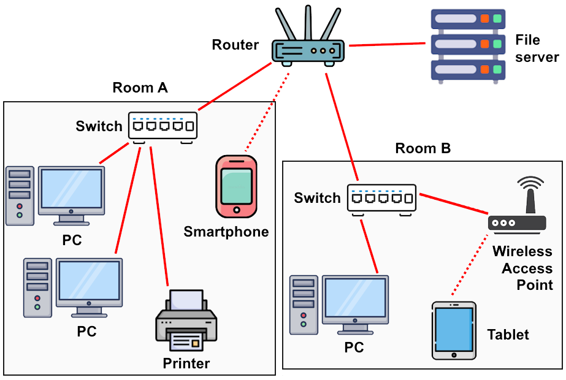

# 3주차

# 1. LAN

## 1.1 LAN 정의

- Local Area Network
- LAN은 한 건물 또는 제한된 지역 내의 컴퓨터와 주변 장치들이 서로 데이터를 주고 받을 수 있게 연결한 네트워크를 의미
    - 예) 사무실 내부의 PC, 프린터, 스마트폰 등 유·무선으로 서로 연결되어 파일이나 프린터 등을 공동으로 사용하는 환경

## 1.2 LAN 특징

- LAN 내부의 각 장치는 고유한 내부 IP 주소(사설 IP)를 부여받아 통신
- 좁은 물리적 범위 내에서 빠른 속도(대역폭)를 제공
- 일반적으로 LAN을 외부 인터넷(광범위 통신망, WAN)에 연결해주는 장비가 ‘라우터(공유기)’
- 라우터의 LAN 측(내부망 쪽) IP 주소를 ‘게이트웨이(gateway)’라고 부르며, 내부 장치들은 이 주소를 통해 외부 네트워크로 나가게 됨

# 2. 케이블과 리피터, 허브 속의 신호 흐름

## 2.1 케이블(Cable)

- 네트워크에서 데이터를 전달하는 **물리적 선로**
- 일반적으로 꼬임쌍선(UTP/STP 케이블), 광섬유 등 다양한 형태가 쓰임
- 전기신호(또는 광신호)가 케이블을 따라 이동하는데, 거리가 길어질수록 신호가 **감쇠**(약해짐)되고 잡음 간섭이 커짐
- 이러한 신호 약화나 왜곡을 막기 위해 중간에 신호를 재생(정형)해주는 장치(리피터 등)를 두는 경우가 있음

## 2.2 리피터(Repeater)

- **신호 증폭 중계기**로 1계층(물리 계층) 장비임
- 케이블을 통해 전송되다가 약해진 전기 신호를 입력받아 같은 형태의 신호를 새로 재생(정형)하고 증폭하여 출력함
- 이를 통해 거리가 멀어도 원본 신호를 ‘복원’하여 더 먼 거리로 전송할 수 있게 해준다
- 과거에는 LAN 세그먼트를 연장할 때 많이 사용했으나 현대 스위치나 기타 장비에 대부분 내장되어 별도 리피터가 쓰이는 경우는 드물다

## 2.3 허브(Hub)

- 여러 장치를 연결해주는 장비로 **멀티포트 리피터**라고도 부름
- 허브로 들어온 신호(패킷)는 **연결된 모든 다른 포트**로 그대로 보내진다(브로드캐스트)
    - 예: A에서 들어온 패킷이 B, C, D 등 모든 장치에게 전송됨
- **OSI 1계층**(물리 계층) 장비이므로, 목적지 MAC 주소를 확인하거나 IP를 확인하는 등의 ‘지능적’ 기능이 없다
- 허브에 연결된 장치들은 공통 대역폭을 나눠 쓰므로 동시에 다량의 트래픽이 오갈 경우 충돌이 발생할 수 있다(CSMA/CD 환경)
- **현재는 스위치(스위칭 허브)에 의해 거의 대체**되어 단순 허브가 사용되는 경우가 거의 없음

# 3. 스위치(Switch, 스위칭 허브)

## 3.1 기본 개념

- **허브의 단점을 보완**하여 등장한 **지능형 중계 장비**이다
- 보통 **스위칭 허브**라고 부르며 **OSI 2계층(데이터 링크 계층)**에서 동작
- 허브와 달리 **수신한 이더넷 프레임의 MAC 주소**를 검사해 목적지 MAC이 연결된 포트로만 트래픽을 보낸다
    - A → B 통신이라면 B가 있는 포트에만 데이터를 전달하고 나머지 장치들에게는 불필요하게 데이터를 뿌리지 않는다

## 3.2 MAC 주소 테이블(MAC Address Table)

- 스위치 내부에 존재하는 메모리 표
- 스위치는 프레임을 수신할 때 **소스 MAC 주소**와 해당 프레임이 들어온 **포트** 정보를 학습(레너닝)하여 테이블에 기록해 둠
- 이후 프레임을 포워딩할 때는 **목적지 MAC 주소**가 어느 포트에 연결되어 있는지 테이블을 참조해 해당 포트로만 데이터를 전달한다
- **학습(Learning)과 포워딩(Forwarding)** 기능을 통해 트래픽 방송을 최소화하고 각 포트 간 충돌 없이 효율적인 통신이 가능해진다
- 만약 스위치가 목적지 MAC 주소를 아직 모르는 경우, 모든 포트에 프레임을 뿌리는 ‘홍수(Flooding)’를 수행해 목적지를 찾고 찾으면 테이블에 기록한다

## 3.3 스위치의 장점

- 허브와 달리 **불필요한 브로드캐스트**가 줄어듬
- 각 포트가 독립적으로 통신할 수 있어 **대역폭 충돌**(Collision)을 크게 줄여 네트워크 효율을 높인다
- 현대의 유선 LAN 환경에서 **스위치는 사실상 필수 장비**이며 예전의 단순 허브는 거의 없어짐

# 4. 라우터(Router)

## 4.1 기본 개념

- **서로 다른 IP 네트워크(서브넷) 간**을 연결하여 패킷을 전달(라우팅)하는 장치
- **OSI 3계층(네트워크 계층)**에서 동작한다
- 스위치가 같은 LAN 내부에서 MAC 주소 기반으로 데이터를 중계한다면 라우터는 **IP 주소**를 보고 다음 네트워크로 패킷을 보냄
- **라우팅 테이블**을 참조하여 목적지 IP 주소가 어느 네트워크에 속하는지 판단하고 적절한 인터페이스(포트)나 다음 홉(next hop)으로 패킷을 전달함

## 4.2 LAN과 WAN의 연결

- 가정이나 사무실에서 쓰이는 공유기(라우터)는 내부의 LAN(사설 IP 주소 대역)과 외부 인터넷(공인 IP 대역)을 동시에 연결
- 내부 PC가 외부 서버와 통신하고자 하면 목적지 IP가 ‘내부망이 아님’을 인지하고 **기본 게이트웨이(라우터 IP)**로 패킷을 보냄
- 라우터는 이를 받아서 **인터넷 쪽 회선**(WAN 포트 등)으로 패킷을 전달함
- 다른 네트워크로 패킷을 넘기는 과정에서 **출발지 MAC 주소**가 라우터의 MAC으로 바뀌고 **TTL 감소** 등 3계층 라우팅을 위한 헤더 수정이 이루어진다

## 4.3 서브넷 간 분리와 방화벽 역할

- 라우터는 서로 다른 IP 서브넷을 연결하기 때문에, **한 서브넷의 브로드캐스트**를 다른 서브넷으로 보내지 않음
- 기본적으로 **서브넷 간 방화벽** 역할을 수행하여, 불필요한 트래픽이 임의로 넘어오지 못하도록 차단
- 이는 네트워크를 효율적으로 분리·보호하는 데 유용함

## 4.4 스위치 vs. 라우터

- **스위치**는 같은 네트워크(서브넷) 내부에서 MAC 주소에 기반해 프레임을 전달하는 역할
- **라우터**는 여러 네트워크(서브넷) 사이를 연결하여 IP 기반으로 패킷을 중계(라우팅)하는 역할

# 5. 라우터의 부가 기능

## 5.1 NAT(Network Address Translation)

- 내부 사설 IP 주소를 **공인 IP 주소**로 변환해주는 기능
- 하나의 공인 IP를 여러 내부 장치가 공유하여 인터넷에 접속하게 만들어 준다
- 내부 장치가 외부로 패킷을 보낼 때, **출발지 IP**를 공유기의 공인 IP로 바꾸고 돌아오는 응답 패킷은 다시 **원래의 내부 IP**로 재매핑해 준다
- 덕분에 가정이나 소규모 회사에서 ISP로부터 제공받은 공인 IP 하나만으로도 여러 기기가 인터넷 사용이 가능하다

## 5.2 DHCP(Dynamic Host Configuration Protocol)

- **IP 주소 자동 할당** 기능
- 라우터에 내장된 DHCP 서버가 내부망에 새로 접속한 기기(클라이언트)들에게 IP 주소, 서브넷 마스크, 게이트웨이, DNS 서버 정보 등을 자동으로 부여한다
- 사용자는 장치마다 네트워크 설정을 일일이 수동으로 입력할 필요가 없다

## 5.3 기본 방화벽 및 포트 포워딩

- 라우터는 외부로부터 들어오는 불필요하거나 위험한 트래픽을 기본적으로 차단(필터링)한다
- **포트 포워딩** 기능: 특정 내부 장치로 외부에서 접근하도록 설정(예: 3389/TCP 원격 데스크톱 접속 등)
- 가정용 공유기에는 보통 **스위치 허브(유선 포트)**와 무선 AP(Access Point) 기능이 모두 내장되어 하나의 장비로 유무선 LAN과 인터넷 연결을 모두 제공한다

# 6. 용어정리

## 6.1 서브넷(Subnet)

- 하나의 IP 네트워크 주소 범위를 마스크로 나누어 만든 **논리적 구역**
    - 예: 192.168.1.0/24, 192.168.10.0/24 등
- 같은 서브넷 안의 장치들은 라우터 없이 직접 통신이 가능하지만 다른 서브넷과 통신하려면 **라우터(게이트웨이)**를 거쳐야 한다
- 서브넷을 나누면 **브로드캐스트 범위**가 줄어들어 네트워크 효율과 보안을 높일 수 있다

## 6.2 게이트웨이(Gateway)

- **네트워크의 출입문** 역할을 하는 장치 혹은 IP 주소
- 보통 “기본 게이트웨이”는 라우터의 LAN 측 IP 주소를 의미하며 내부 장치가 외부(다른 서브넷)로 나갈 때 이 주소를 경유한다
- 예: 집에서 PC의 기본 게이트웨이가 192.168.0.1이라면 그것은 공유기의 LAN IP이고 공유기가 인터넷으로의 연결을 담당한다